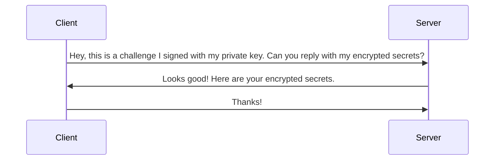

# Bento (Box)

I am tired of moving secrets from computer to another so I decided to make this CLI tool.
I could use something like Vault to do the job but I have a developer brain cell and just want to re-invent
the wheel again.

This CLI tool simplifies secure secret management for your projects. It leverages a config file (`.bento.yml`) to seamlessly load secrets into a `.env` file by running `bento goodies`.
For authentication, it utilizes asymmetric keys (public/private) so there won't be a password and the private key is managed by the user.

The CLI talks to a [Konbini](https://github.com/juancwu/konbini) to store/retrieve secrets.

## Authentication Flow

The server just rejects the client if the signature failed to verify and not response with the encrypted secrets.
The keyword here is `encrypted`. All secrets are first encrypted on the client side
and then sent to the server to store them. The server will never have raw secrets stored
and during transportation of the secrets as well.
